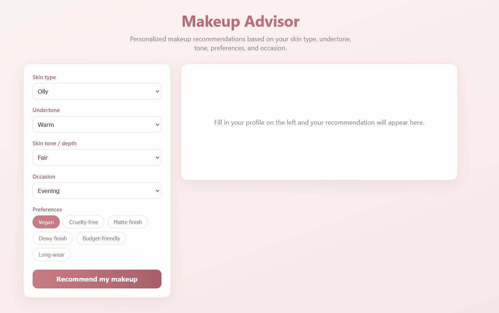

#  Makeup Advisor

Web app that recommends makeup products and styles based on skin type, undertone, tone, preferences, and occasion. It combines a rule-based engine for style advice with content-based scoring to rank products.

## Demo



## How it works

1. **Import** – Loads a product catalog from the Makeup API and falls back to a local seed file when the API is unavailable.
2. **Rules** – A rule-based engine maps the user profile (skin type, undertone, occasion) to a recommended style: foundation, lipstick, blush, and eyes.
3. **Scoring** – Content-based scoring ranks catalog products against the request (finish match, preferences, rating) and returns the top matches with reasons.
4. **History** – Each request and its result are stored in SQLite.

## Tech stack

- **Backend:** Clojure (Leiningen), Ring + Compojure, next.jdbc + honeysql, SQLite
- **Frontend:** React (Create React App)
- **Data:** Makeup API with a local seed fallback (931 products)

## Project structure

```
backend/    Clojure REST API + engine + SQLite
  src/...   engine.clj, core.clj, db.clj, import.clj, web.clj
frontend/   React app
```

## Prerequisites

1. [Java (JDK 17)](https://adoptium.net/)
2. [Leiningen](https://leiningen.org/)
3. [Node.js](https://nodejs.org/)

## Running the app

### Backend

The backend is started from a REPL inside IntelliJ IDEA (with the Cursive plugin).

1. Open the `backend` folder as a project in IntelliJ.
2. Start a REPL: **Run → Edit Configurations → + → Clojure REPL → Local**, select **Run with: Leiningen**, then run it.
3. Once the REPL is connected, start the server by evaluating:

```clojure
(require '[vestacka-inteligencija-projekat-makeupadvisor_2025_3829.web :as web])
(web/-main)
```
Starts the API on http://localhost:3001. On first run it creates the SQLite database and loads the product catalog.

### Frontend

```
cd frontend
npm install
npm start
```

Opens the app on http://localhost:3000.

## API endpoints

```
GET  /health          # health check -> {"status":"ok"}
GET  /products        # full product catalog
GET  /history         # last 10 recommendations
GET  /products/:type  # products of a single type (e.g. /products/lipstick)   
POST /recommend       # main endpoint, returns a recommendation
```

## Request format

```
POST /recommend

skin-type    dry | oily | combination | sensitive | normal
undertone    warm | cool | neutral
skin-tone    fair | medium | deep
occasion     everyday | work | evening | party | wedding
preferences  any of: vegan, cruelty free, matte, dewy, budget, longwear

```
